# ✨ Wuhhuu Touch | Ultimate Magic Edition


> **"Any sufficiently advanced technology is indistinguishable from magic."** > — *Arthur C. Clarke*

---

## 🚀 Overview

**Wuhhuu Touch** is an interactive, browser-based **3D Particle System** controlled by real-time hand gestures. It transforms your webcam feed into a magical controller, allowing you to manipulate **30,000 glowing particles** using computer vision and physics simulations.

It was built to bridge the gap between **Creative Coding**, **AI Vision**, and **Physics Engines**.

---

## 🔮 The Experience

| Gesture | Action | Visual Effect |
| :--- | :--- | :--- |
| **✊ FIST** | `Gather Energy` | Particles are sucked into a gravity well at your hand's position. |
| **🖐 OPEN** | `Cast Spell` | Particles explode outwards in a massive splash of color. |
| **👋 MOVE** | `Guide Magic` | The particle cloud follows your hand position in 3D space. |

---

## 🧠 System Architecture (The Brains)

Here is how the data flows from your webcam to the screen.

```mermaid
graph TD
    A[🎥 Webcam Input] -->|Video Stream| B(MediaPipe AI Engine)
    B -->|Detect Hand| C{Hand Found?}
    C -->|Yes| D[Extract Coordinates x,y]
    C -->|No| E[Idle Mode]
    D -->|Map 2D to 3D| F[Physics Engine]
    F -->|Apply Forces| G[Update 30,000 Particles]
    G -->|Render Frame| H[Three.js Canvas]
    H -->|Add Glow| I[✨ User Screen]

```



---

## ⚛️ The Physics Engine (The Heart)

Every single frame (60 times per second), the application runs this logic loop to determine where every particle should be.


### The Math Behind the Magic

We use a custom implementation of **Newtonian Physics** for the particles.

* **Elasticity:** 
* **Interaction:** 
* **Color Shift:** 

---

## 📂 Project Structure

A clean and simple architecture using native ES Modules.

```text
wuhhuu-touch/
├── 📄 index.html       // The entry point & UI overlay
├── 🎨 style.css        // Glassmorphism styling & animations
├── 🧠 main.js          // The core logic (Three.js + MediaPipe + Physics)
└── 📄 README.md        // Documentation

```

---

## 🛠 Tech Stack

* **Render Engine:** [Three.js](https://threejs.org/) (WebGL)
* **Computer Vision:** [Google MediaPipe](https://developers.google.com/mediapipe) (Hand Landmark Detection)
* **Post Processing:** UnrealBloomPass (For the neon glow effect)
* **Math:** Vector Arithmetic & Polar Coordinates
* **Language:** Vanilla JavaScript (ES6+)

---

## 💻 How to Run Locally

Since this project uses the Webcam API and ES Modules, it requires a local server.

1. **Clone the Repository**
```bash
git clone https://github.com/Sbasnayaka/Wuhhuu-Touch.git

```


2. **Open in Visual Studio Code**
```bash
cd wuhhuu-touch
code .

```


3. **Start Live Server**
* Install the **"Live Server"** extension in VS Code.
* Click **"Go Live"** at the bottom right corner.


4. **Allow Permissions**
* Your browser will ask for Camera access. Click **Allow**.


---

## 🤖 AI Collaboration Statement

This project was built as a **Learning Experiment** in collaboration with Generative AI.

* **Concept & Logic:** Interactive Particle Physics system.
* **AI Role:** Assisted in generating complex 3D shape algorithms (Volumetric Heart/Star), debugging the Physics Loop, and optimizing the Render Loop.
* **Goal:** To demonstrate how AI can accelerate the learning curve for complex 3D graphics and Computer Vision.

---


## 🌟 Features Breakdown

* **Dynamic Particles:** 30,000 individual points.
* **Reactive Colors:** Particles turn White/Gold when moving fast (high energy) and cool down to Blue/Purple when stationary.
* **4 Shapes:**
* **Sphere:** The default cloud.
* **Heart:** A volumetric 3D heart.
* **Star:** A sharp, geometric 5-point star.
* **Cube:** A structured box.


* **Responsive:** Auto-rotates when idle, locks control when a hand is detected.

---

### License

This project is open source. Feel free to use it to learn!
